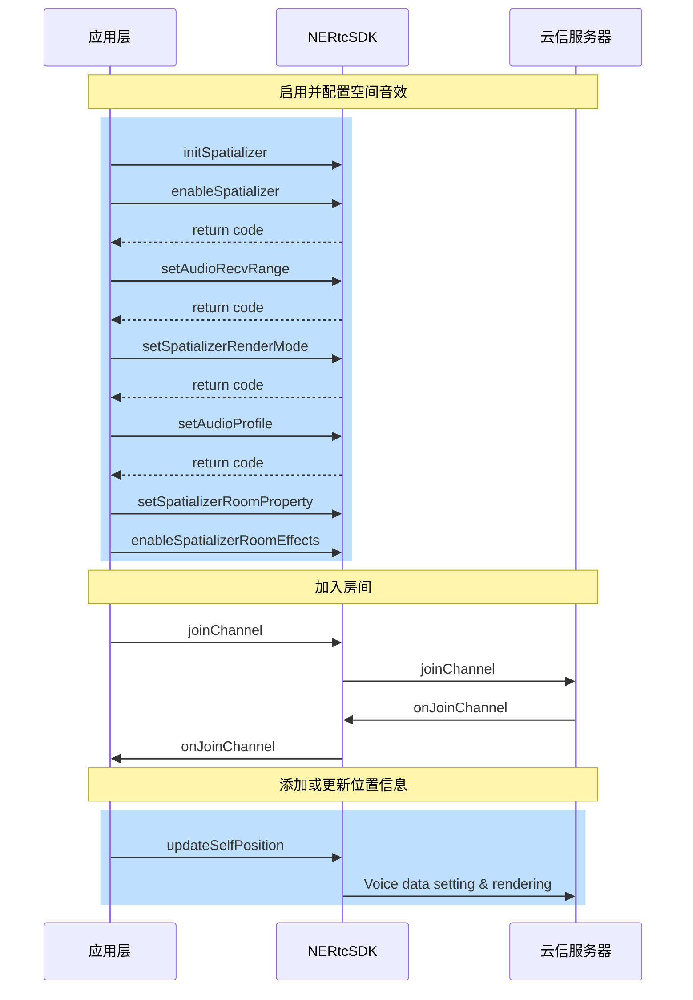

空间音效也称 3D 音效，是通过在音频信号中添加空间信息，使得听众可以感受到声音来自于特定的位置和空间环境。它可以增强音频的真实感和沉浸感，让听众感受到更加真实的声音效果。

## 功能介绍
NERTC SDK 从 V5.4.0 开始支持空间音效。

空间音效可以将实时语音渲染成具有空间方位的效果。同时，空间音效具有房间混响，距离衰减和范围语音等属性，综合使用相关属性可以提升空间音效的真实感和沉浸感。

例如，在游戏中模拟真实世界的空间音效，玩家可以感知说话者的 3D 空间方位。同时，空间音效可以根据双方距离的远近实现语音音量的衰减，使近处的声音更响亮，远处的声音更低。这样可以让玩家更清晰地感受到游戏中的环境和位置信息，增强游戏的沉浸感和真实感。此外，空间音效还可以应用于虚拟现实和增强现实等领域，让用户更真实地感受虚拟环境中的声音效果。

## 功能原理

空间音效涉及到音频源和接收者两个对象。在RTC场景下，开启空间音效时，发送端会在语音中包含自身的坐标信息，远端接收该音频信息时，会将其作为音频源。接收者会基于自身坐标、接收到的音频及其位置，将音频渲染到特定方位，然后进行播放。

空间音效利用头部相关转换函数（HRTF）和声波空间卷积模仿自然声波的传播，使其仿佛来自三维空间中的一个点。空间音效通过方向、距离和环境三个关键因素实现空间感的形成。

空间音效的距离衰减和语音范围如下图所示。


## 注意事项

需要用户佩戴**有线耳机**体验空间音效功能，暂不支持蓝牙耳机。

## API 调用时序



  
## 实现方法

### 1. 启用空间音效

1. 请在**引擎初始化之后（<a href="https://doc.yunxin.163.com/nertc/api-refer/iOS/doxygen/Latest/zh/html/protocol_i_n_e_rtc_link_engine-p.html#a3889b6260b6b2cd54928e878a99b68f8" target="_blank">`setUpEngineWithContext`</a>）**，调用 [`initSpatializer`](https://doc.yunxin.163.com/nertc/api-refer/iOS/doxygen/Latest/zh/html/protocol_i_n_e_rtc_engine_ex-p.html#a2d804561873d6e7916af1dd01222f512) 方法初始化空间音效。

2. **加入房间（<a href="https://doc.yunxin.163.com/nertc/api-refer/iOS/doxygen/Latest/zh/html/protocol_i_n_e_rtc_engine-p.html#adf60d9392e4b50ff73872138965f022f" target="_blank">`joinChannelWithToken`</a>）之前**调用 <a href="https://doc.yunxin.163.com/nertc/api-refer/iOS/doxygen/Latest/zh/html/protocol_i_n_e_rtc_engine_ex-p.html#ab4439f9e0cabe9fe18d42bbece1bb4ee" target="_blank">`enableSpatializer`</a> 方法以启用音频空间化, 如果您需要只针对本小队开启 3D 音效, 设置 `apply_to_team` 为 `true`。

**示例代码**如下：
```
//打开空间音效功能
- (void)enable3DAudio {
    //需要在执行完`setupEngineWithContext:`接口之后调用
    [[NERtcEngine sharedEngine] initSpatializer];
    [[NERtcEngine sharedEngine] enableSpatializer:YES applyToTeam:NO];

    //audio profile must be stereo,2 channels
    [[NERtcEngine sharedEngine] setAudioProfile:kNERtcAudioProfileHighQualityStereo scenario:kNERtcAudioScenarioMusic];
}
```

### 2. 设置距离衰减和语音范围

在加入房间前，调用 <a href="https://doc.yunxin.163.com/nertc/api-refer/iOS/doxygen/Latest/zh/html/protocol_i_n_e_rtc_engine_ex-p.html#a52a7a8ed8abe2ee92be3d7a67c855e1f" target="_blank">`setAudioRecvRange`</a> 方法设置空间音效的距离衰减属性和语音范围，该属性可以让声音随着音频源和接收者之间距离的增加逐渐衰减音量。

::: note notice
- 距离衰减属性需要在加入房间之前设置，在通话过程中无法修改该属性，只有退出房间后才可重新设置。
- 空间音效房间内的成员需要**都开启或都关闭**，否则会无法听到对方声音。
:::

**参数描述**如下表所示：

| 参数 | 描述 | 
| ---- | -------------- | 
| audibleDistance | 监听器能接收到音频的最大距离，用户的声音在该范围内可被听见。取值范围：[1, max int) ，无默认值。| 
| conversationalDistance | 监听器不对音频进行衰减的距离，在该距离范围内，扬声器音频保持其原始音量，超出该范围时，声音将会随距离的增加而衰减。默认值为 1。| 
| rollOff | 距离衰减模式。一共有三种：|\
|| - kNERtcDistanceRolloffLogarithmic（0）：指数衰减。|\
|| - kNERtcDistanceRolloffLinear（1）：线性衰减。|\
|| - kNERtcDistanceRolloffNone（2）：无衰减。| \
|| - kNERtcDistanceRolloffLinearOnly（3）：仅线性衰减, 没有方位效果|

**示例代码**如下：

```
// 设置接收范围和声音衰减模型
-(void)setup3DAudioRecvRange {
    //需要在`EnableSpatializer`执行成功之后调用。
    [[NERtcEngine sharedEngine] setAudioRecvRange:50 conversationalDistance:1 rollOff:kNERtcDistanceRolloffNone];
    // ...
}
```

### 3. 设置渲染模式

在加入房间前，调用 <a href="https://doc.yunxin.163.com/nertc/api-refer/iOS/doxygen/Latest/zh/html/protocol_i_n_e_rtc_engine_ex-p.html#a91962b616254bc447297d175ffe516d9" target="_blank">`setSpatializerRenderMode`</a> 方法设置渲染模式，通过设置 `mode` 参数选择不同复杂程度的算法以实现不同的听觉效果。

其中 <a href="https://doc.yunxin.163.com/nertc/api-refer/iOS/doxygen/Latest/zh/html/_n_e_rtc_engine_enum_8h.html#a5da77cff7e2b986c299a2c3e3b6007e5" target="_blank">`NERtcSpatializerRenderMode`</a> 类型的各字段说明如下表所示。

| 字段| 描述 | 
| ---- | ---- |
| kNERtcSpatializerRenderStereoPanning | 立体声 PANNing 方法 | 
| kNERtcSpatializerRenderBinauralLowQuality | 低复杂度双耳渲染方法 | 
| kNERtcSpatializerRenderBinauralMediumQuality | 中复杂度双耳渲染方法 | 
| kNERtcSpatializerRenderBinauralHighQuality | 高复杂度双耳渲染方法(推荐) | 
| kNERtcSpatializerRenderRoomEffectsOnly | 仅房间混响 |

**示例代码**如下：

```
// 设置空间语音渲染模式
-（void)setup3DAudioRenderMode {
    //需要在`EnableSpatializer`执行成功之后调用。

    [[NERtcEngine sharedEngine] setSpatializerRenderMode:kNERtcSpatializerRenderBinauralHighQuality];
    // ...
}
```

### 4. 设置音频属性

在加入房间前，调用 <a href="https://doc.yunxin.163.com/nertc/api-refer/iOS/doxygen/Latest/zh/html/protocol_i_n_e_rtc_engine-p.html#a79daa01fb308cf2b70d27fb7f73cab01" target="_blank">`setAudioProfile`</a> 方法将音频类型（`NERtcAudioProfileType`）设置为 `kNERtcAudioProfileMiddleQualityStereo` 或者 `kNERtcAudioProfileHighQualityStereo`，并将音频场景（`NERtcAudioScenarioType`）设置为 `kNERtcAudioScenarioMusic`。

```
// 设置音频属性
-(void)setup3DAudioProfile {
    //需要在`setupEngineWithContext`执行成功之后,`JoinChannel`之前调用

    [[NERtcEngine sharedEngine] setAudioProfile:kNERtcAudioProfileMiddleQualityStereo scenario:kNERtcAudioScenarioMusic];   
    // ...
}
```

### 5. 设置房间混响属性（可选）

1. 调用 <a href="https://doc.yunxin.163.com/nertc/api-refer/iOS/doxygen/Latest/zh/html/protocol_i_n_e_rtc_engine_ex-p.html#a922ee5cd068c8bcb1a358039be325293" target="_blank">`setSpatializerRoomProperty`</a> 方法设置 `roomProperty` 参数预设的房间大小，混响时长，混响增益，音色亮度等参数，以调整房间混响效果。

其中 <a href="https://doc.yunxin.163.com/nertc/api-refer/iOS/doxygen/Latest/zh/html/interface_n_e_rtc_spatializer_room_property.html" target="_blank">`NERtcSpatializerRoomProperty`</a> 类型的各字段说明如下表所示。

| 参数 | 类型 | 描述 |
| ---- | ---- |---- |
| roomCapacity | NERtcSpatializerRoomCapacity | 房间大小，默认值为 `kNERtcSpatializerRoomCapacitySmall`。<br> 房间大小的枚举值请参见[`NERtcSpatializerRoomCapacity`](https://doc.yunxin.163.com/nertc/api-refer/iOS/doxygen/Latest/zh/html/_n_e_rtc_engine_enum_8h.html#af083f64f62dae2a69518713f8e14aceb)|
| material | NERtcSpatializerMaterialName | 房间材质，默认值为 `kNERtcSpatializerMaterialTransparent`。<br>更多的房间材质请参见[`NERtcSpatializerMaterialName`](https://doc.yunxin.163.com/nertc/api-refer/iOS/doxygen/Latest/zh/html/_n_e_rtc_engine_enum_8h.html#ad7f83fa93f38f67615ceb2b798e9b7c4) |
| reflectionScalar | CGFloat | 混响反射比例因子，默认值为 1.0 |
| reverbGain |CGFloat| 混响增益比例因子，默认值为 1.0 |
| reverbTime |CGFloat| 混响时间比例因子，默认值为 1.0 |
| reverbBrightness |CGFloat| 混响音色亮度，默认值为 1.0 |

2. 调用 <a href="https://doc.yunxin.163.com/nertc/api-refer/iOS/doxygen/Latest/zh/html/protocol_i_n_e_rtc_engine_ex-p.html#ac9cd94d5768f789d3d623d654a771057" target="_blank">`enableSpatializerRoomEffects`</a> 方法，设置 `enable` 参数为 `YES` 或 `NO` 以开启或关闭空间音效的房间混响效果。
3. 调用 <a href="https://doc.yunxin.163.com/nertc/api-refer/iOS/doxygen/Latest/zh/html/protocol_i_n_e_rtc_engine_ex-p.html#a1a4bc51bab589f5c6041147bfd621999" target="_blank">`enableSpatializer`</a> 方法，设置 `enable` 参数为 `YES` 或 `NO` 以开启或关闭 3D 音效。

    3D 音效可以让声音有 3D 空间感且按距离衰减。

### 6. 添加或更新位置信息

在加入房间后，调用 <a href="https://doc.yunxin.163.com/nertc/api-refer/iOS/doxygen/Latest/zh/html/protocol_i_n_e_rtc_engine_ex-p.html#a35a7c30c6a9ecc3ed20092af3fee7410" target="_blank">`updateSelfPosition`</a> 方法并设置 `info` 参数，以更新音频源或接收者的空间位置信息 <a href="https://doc.yunxin.163.com/nertc/api-refer/iOS/doxygen/Latest/zh/html/interface_n_e_rtc_position_info.html" target="_blank">`NERtcPositionInfo`</a>，从而实现空间音频定位特效。
::: note note
- 通常在 3D 网络游戏开始后，都能获取地图上角色 `GameObject` 相互的坐标，此坐标即调用 `updateSelfPosition` 方法时需要更新的角色坐标。
- 建议在一定间隔内更新角色位置信息，以保证画面和音频位置同步，推荐更新频率为 10 ~ 25次/秒。
- 发声者旋转角度的参数值暂时不起作用，保持默认值即可。
:::


| 参数 | 类型 | 描述 |
| ---- | ---- |---- |
| speakerPositionX |CGFloat| 发声坐标，表示左右，默认值为 0 |
| speakerPositionY |CGFloat| 发声坐标，表示上下，默认值为 0 |
| speakerPositionZ |CGFloat| 发声坐标，表示前后，默认值为 0 |
| speakerQuaternionX |CGFloat| 发声旋转角度，4元素，默认值为 0 |
| speakerQuaternionY |CGFloat| 发声旋转角度，4元素，默认值为 0 |
| speakerQuaternionZ |CGFloat| 发声旋转角度，4元素，默认值为 0 |
| speakerQuaternionW |CGFloat| 发声旋转角度，4元素，默认值为 0 |
| headPositionX |CGFloat| 听觉坐标，表示左右，默认值为 0 |
| headPositionY |CGFloat| 听觉坐标，表示上下，默认值为 0 |
| headPositionZ |CGFloat| 听觉坐标，表示前后，默认值为 0 |
| headQuaternionX |CGFloat| 听觉旋转角度，4元素，默认值为 0 |
| headQuaternionY |CGFloat| 听觉旋转角度，4元素，默认值为 0 |
| headQuaternionZ |CGFloat| 听觉旋转角度，4元素，默认值为 0 |
| headQuaternionW |CGFloat| 听觉旋转角度，4元素，默认值为 0 |


**示例代码**如下：
//step1: 打开空间音效
int result = [engineEx initSpatializer];
if (result != kNERtcNoError) {
    NSLog(@"初始化空间音效失败: %d", result);
    return;
}

// 开启空间音效
// enabled: YES 表示开启，NO 表示关闭
// applyToTeam: NO 表示对所有用户生效，YES 表示仅对本小队生效
result = [engineEx enableSpatializer:YES applyToTeam:NO];
if (result != kNERtcNoError) {
    NSLog(@"开启空间音效失败: %d", result);
    return;
}

//step2: 设置空间音效的相关属性
//step2.1: 设置音频接收范围
// 假设从 UI 或配置中获取的参数值
int audibleDistance = 32;        // 可听距离
int conversationalDistance = 1;  // 对话距离
NERtcDistanceRolloffModel rollOff = kNERtcDistanceRolloffLinear; // 距离衰减模式

// 设置音频接收范围
result = [engineEx setAudioRecvRange:audibleDistance 
                 conversationalDistance:conversationalDistance 
                                rollOff:rollOff];
if (result != kNERtcNoError) {
    NSLog(@"设置音频接收范围失败: %d", result);
    return;
}
//step2.2:设置空间音效渲染模式
// 假设从 UI 选择器中获取的渲染模式索引
NSInteger renderModeIndex = 3; // 例如：BinauralHighQuality
NERtcSpatializerRenderMode renderMode = (NERtcSpatializerRenderMode)renderModeIndex;

// 设置渲染模式
result = [engineEx setSpatializerRenderMode:renderMode];
if (result != kNERtcNoError) {
    NSLog(@"设置渲染模式失败: %d", result);
    return;
}
//step2.3:开启空间音效房间混响效果
// 开启房间混响效果
BOOL enableRoomEffects = YES;
result = [engineEx enableSpatializerRoomEffects:enableRoomEffects];
if (result != kNERtcNoError) {
    NSLog(@"开启房间混响效果失败: %d", result);
    return;
}
//step2.4:设置空间音效房间属性
// 创建房间属性对象
NERtcSpatializerRoomProperty *roomProperty = [[NERtcSpatializerRoomProperty alloc] init];

// 设置房间大小（假设从 UI 选择器获取）
NSInteger roomSizeIndex = 1; // 例如：Medium
roomProperty.roomCapacity = (NERtcSpatializerRoomCapacity)roomSizeIndex;

// 设置房间材质（假设从 UI 选择器获取）
NSInteger materialIndex = 0; // 例如：Transparent
roomProperty.material = (NERtcSpatializerMaterialName)materialIndex;

// 设置反射比例
roomProperty.reflectionScalar = 1.0;

// 设置混响增益
roomProperty.reverbGain = 1.0;

// 设置混响时间
roomProperty.reverbTime = 1.0;

// 设置混响亮度
roomProperty.reverbBrightness = 1.0;

// 应用房间属性设置
result = [engineEx setSpatializerRoomProperty:roomProperty];
if (result != kNERtcNoError) {
    NSLog(@"设置房间属性失败: %d", result);
    return;
}
//step3:添加或更新位置信息
// 创建位置信息对象
NERtcPositionInfo *positionInfo = [[NERtcPositionInfo alloc] init];

// 假设从 UI 输入或配置中获取的坐标值
// 说话者位置（3D 坐标）
CGFloat speakerX = 0.0;
CGFloat speakerY = 0.0;
CGFloat speakerZ = 0.0;

// 说话者旋转信息（四元数，格式为 {w, x, y, z}）
CGFloat speakerQuatW = 0.0;
CGFloat speakerQuatX = 0.0;
CGFloat speakerQuatY = 0.0;
CGFloat speakerQuatZ = 0.0;

// 接收者（头部）位置（3D 坐标）
CGFloat headX = 0.0;
CGFloat headY = 0.0;
CGFloat headZ = 0.0;

// 接收者旋转信息（四元数，格式为 {w, x, y, z}）
CGFloat headQuatW = 0.0;
CGFloat headQuatX = 0.0;
CGFloat headQuatY = 0.0;
CGFloat headQuatZ = 0.0;
```
//新建一个定时器，每200ms调用一次下面的函数，就会有3d音效旋转的效果
- (void)onRotationAStep {
    NSMutableArray *position = [NSMutableArray arrayWithObjects:@9.0, @0.0, @9.0, nil]; // 初始化位置数组
    NSMutableArray *queternion = [NSMutableArray arrayWithObjects:@0.0, @0.0, @0.0, @0.0, nil];// 初始化旋转数组
    NSInteger size = [self.roomCapacityPickerView selectedRowInComponent:0];

    if (size == 0) {
        position[0] = @1.0;
        position[2] = @1.0;
    } else if (size == 1) {
        position[0] = @2.0;
        position[2] = @2.0;
    } else if (size == 2) {
        position[0] = @4.0;
        position[2] = @4.0;
    } else if (size == 3) {
        position[0] = @9.0;
        position[2] = @9.0;
    } else {
        position[0] = @9.0;
        position[2] = @9.0;
    }

    _rotation_step++;

    if (_rotation_step == 180) {
        _rotation_step = 0;
    }

    // 计算旋转数组的值
    queternion[0] = @0.0;
    queternion[1] = @(sin((2.0 * M_PI * _rotation_step) / 180.0));
    queternion[2] = @0.0;
    queternion[3] = @(cos((2.0 * M_PI * _rotation_step) / 180.0));
    [self updateSpatializerInfoUIWithPosition:position queternion:queternion];  //更新UI显示
    
    NERtcPositionInfo *spatializerPositionInfo = [[NERtcPositionInfo alloc] init];

    spatializerPositionInfo.speakerPositionX = [self.speakerPositionTextField0.text doubleValue];
    spatializerPositionInfo.speakerPositionY = [self.speakerPositionTextField1.text doubleValue];
    spatializerPositionInfo.speakerPositionZ = [self.speakerPositionTextField2.text doubleValue];
    spatializerPositionInfo.speakerQuaternionX = [self.speakerQuaternionTextField0.text doubleValue];
    spatializerPositionInfo.speakerQuaternionY = [self.speakerQuaternionTextField1.text doubleValue];
    spatializerPositionInfo.speakerQuaternionZ = [self.speakerQuaternionTextField2.text doubleValue];
    spatializerPositionInfo.speakerQuaternionW = [self.speakerQuaternionTextField3.text doubleValue];
    spatializerPositionInfo.headPositionX = [self.headPositionTextField0.text doubleValue];
    spatializerPositionInfo.headPositionY = [self.headPositionTextField1.text doubleValue];
    spatializerPositionInfo.headPositionZ = [self.headPositionTextField2.text doubleValue];
    spatializerPositionInfo.headQuaternionX = [self.headQuaternionTextField0.text doubleValue];
    spatializerPositionInfo.headQuaternionY = [self.headQuaternionTextField1.text doubleValue];
    spatializerPositionInfo.headQuaternionZ = [self.headQuaternionTextField2.text doubleValue];
    spatializerPositionInfo.headQuaternionW = [self.headQuaternionTextField3.text doubleValue];
    int result = 0;
    if (self.channel) {
        result = [_channel.channel updateSelfPosition:spatializerPositionInfo];
    }
    else{
        result = [[[NTESDemoLogic sharedLogic] getCoreEngine] updateSelfPosition:spatializerPositionInfo];
    }

    NTESCheckResultAndReturn(result, "updateSelfPosition");
}
```


